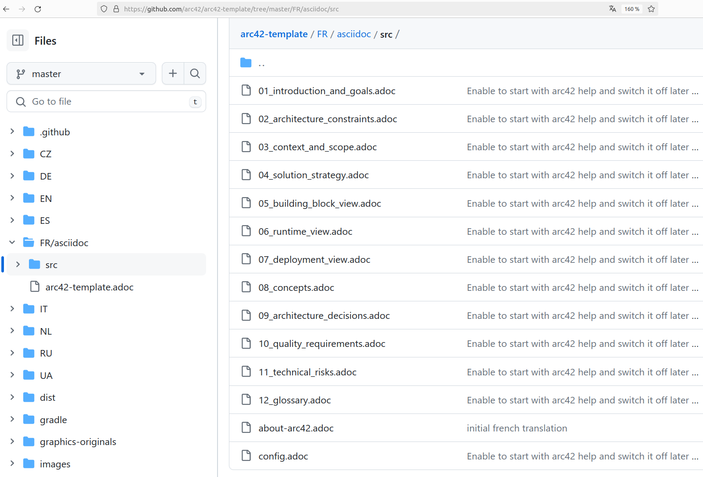

[%notitle]
== Intro

[.notes]
--
* je ne sais pas si *vous avez pu le constater*, mais ayant pu travailler sur *plusieurs projets*
* je me suis rendu compte que *la documentation n'est jamais écrite de la même manière*
* pas la même structure, pas les mêmes titres, pas les mêmes informations ...
* vous avez peut être même déjà *assisté à des réunions pour restructurer* cette documentation car les gens s'y *perdent et ne retrouvent pas les infos*
* partant de ce constat, je me suis demandé s'il n'existait pas un template de référence
* une structure prêt à remplir, adaptable à tout projet
--

[%notitle]
=== arc42

image::images/arc42.png[width=50%]

[%step]
Gernot Starke et Peter Hruschka

[.notes]
--
* template open source, créé par Gernot Starke et Peter Hruschka il y a une dizaine d'années
* décrire *architecture logicielle*, c'est de la *documentation technique*
* disponible sous plein de formats (word, markdown, latex, confluence)
* mais source en *AsciiDoc*
* AsciiDoc c'est comme du *markdown*. et je préfère car c'est *versionnable*, *review*, *générer plusieurs formats*
--

[%notitle, background-color="white"]
=== Github arc42

[.notes]
--
* plusieurs langues, douze parties
* chaque partie va nous guider sur 3 aspects
--

[%notitle]
=== Contenu des parties

[.step]
* Contenu - _que faut-il documenter ?_
* Motivation - _pourquoi documenter ?_
* Représentation - _comment documenter ?_

[.notes]
--
* *durant ce talk*, je vous propose d'*appliquer de manière simple* ce template à un *projet fictif*
* et pour nous aider, nous utiliserons des *outils open source de génération* de documentation
--

[%notitle.columns.is-vcentered.transparency]
=== Présentation

[.blur]

[.column.is-two-fifth]
--
image::images/dlucas.png[]
--

[.column.has-text-left]
****

[.important-text]
--
Damien Lucas

Tech Lead

Architecte
--

image:images/onepoint.png[width=200]

[.vertical-align-middle]
icon:github[] dlucasd

icon:twitter[] dlucasd_

****

[.notes]
--
* vous retrouverez sur github :
** les *slides*
** tous les *outils évoqués* durant le talk
** et pour ceux que je vais vous montrer, un *README expliquant comment les utiliser*
--
