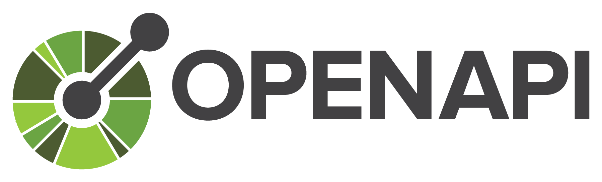
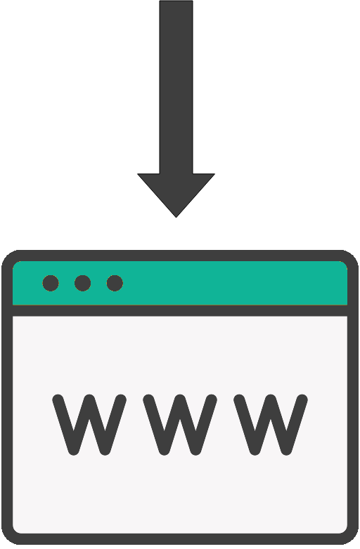

== 1. Introduction et Objectifs

[%notitle.part1]
=== Contenu

Objectifs et contexte du projet.

[.notes]
--
* vue très haut niveau
* grandes fonctionnalités
* pour notre application de billetterie, cela donnerait ...
--

[%notitle%auto-animate.part1]
=== Fonctionnalités

[.bloc]
--
[.overline]#*Grandes fonctionnalités*#
--

[.notes]
--
* grandes fonctionnalités, big picture
--

[%notitle%auto-animate.part1]
=== Fonctionnalités

[.bloc]
--
[.overline]#*Grandes fonctionnalités*#

Acheter des places pour les JO
--

[%notitle%auto-animate.part1]
=== Fonctionnalités

[.bloc]
--
[.overline]#*Grandes fonctionnalités*#

Acheter des places pour les JO

Télécharger les billets achetés
--

[%notitle%auto-animate.part1]
=== Liste des documentations existantes

[.bloc]
--
[.overline]#*Liens vers la documentation existante*#
--

[%notitle%auto-animate.part1]
=== Liste des documentations existantes

[.bloc]
--
[.overline]#*Liens vers la documentation existante*#

Maquettes de l'application
--

[%notitle%auto-animate.part1]
=== Liste des documentations existantes

[.bloc]
--
[.overline]#*Liens vers la documentation existante*#

Maquettes de l'application

Spécifications fonctionnelles
--

[%notitle%auto-animate.part1]
=== Liste des documentations existantes

[.bloc]
--
[.overline]#*Liens vers la documentation existante*#

Maquettes de l'application

Spécifications fonctionnelles

Documentation de référence de l'API REST
--

[.notes]
--
* doc de référence => plutôt répandu, on va la générer.
* et ça tombe bien, mon API REST possède un contrat d'interface !
--

[%notitle%auto-animate.part1]
=== Contrat d'interface

[.notes]
--
* il y a d'autres contrats comme api blueprint, raml, ...
* OpenAPI Specification est le plus populaire (anciennement Swagger)
--

[%notitle%auto-animate.part1]
=== Contrat d'interface

[.nomargin]

[.nomargin]
image::images/asciidoc.png[width=50%]

[%notitle%auto-animate.columns.part1]
=== Contrat d'interface

[.column]
--
[.nomargin]

[.nomargin]
image::images/asciidoc.png[width=70%]
--

[.column]
[.step]
--
OpenAPI Generator

image::images/openapi-generator.png[width=35%]
--

[%notitle%auto-animate.is-vcentered.part1]
=== Contrat d'interface

[.nomargin]

[.nomargin]

[%notitle%auto-animate.is-vcentered.columns.part1]
=== Contrat d'interface

[.column]
--
[.nomargin]

[.nomargin]

--

[.column]
[.step]
--
OpenAPI Generator [.nomargin]#image:images/openapi-generator.png[width=10%]#
--

[%notitle%auto-animate.columns.part1]
=== Contrat d'interface

[.column]
--
[.nomargin]

[.nomargin]

--

[.column]
[.step]
--
OpenAPI Generator [.nomargin]#image:images/openapi-generator.png[width=10%]#

image::images/redoc.png[width=35%]
--

[.notes]
--
* il en existe beaucoup d'autres
* Swagger UI ...
--

[%notitle,background-iframe="./project/api-jo2024/openapi-spec-html/index.html"]
=== OpenAPI Generator Démo

[%notitle,background-iframe="./project/api-jo2024/redocly/index.html"]
=== Redocly Démo

[.notes]
--
* ces informations doivent être *présentes dans le contrat d'interface*
* renvoi vers la *spécification OpenAPI* pour tirer parti au mieux de ces outils
--

[%notitle.part1]
=== Génération de contrat d'interface

Pas de contrat d'interface ?

[.notes]
--
* possibilité de le *générer à partir du code source*
* plein d'outils permettant de le faire, venant du *monde Java/Spring* j'évoquerai *SpringDoc*
* dispo pour tous les langages et framework : .NET, Node.js ... 
--

[%notitle.part1]
=== Pas d'API REST ?

Pas d'API REST ?

[.notes]
--
* Javadoc
* JSDoc
* Asciidoclet, Javadoc avec la *syntaxe Asciidoc* pour apporter plus de *richesse et* de *lisibilité*
* JEP 467 : markdown pour écrire la Javadoc, sorti Java23
* *attention*, je ne dis pas qu'il faut utiliser ces outils, certaines personnes considèrent que ça peut *polluer ou alourdir le code*
* à vous de voir avec votre équipe
--
