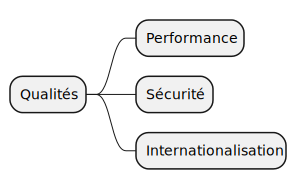

== 10. Critères de qualité

[%notitle.part10]
=== Contenu

Critères de qualité et cas d'utilisation permettant de les évaluer.

[.notes]
--
* les critères de qualité ont une *influence sur les décisions* architecturales
--

[%notitle.part10]
=== Arbre de qualité

[.img-radius]

[.notes]
--
* c'est parfois vague, générique
* c'est pourquoi il faut les relier à des scénarios concrets
--

[%notitle%auto-animate.part10]
=== Scénario Performance

[.bloc]
--
[.overline]#*Performance*#

Gestion d'au moins 10 000 transactions simultanées lors de la vente de billets tout en répondant aux utilisateurs en moins d'une seconde.
--

[.notes]
--
* le cas est *mesurable*, on peut mettre en place des *tirs de perf* répondant à cela 
* perso je n'ai que *très peu rempli cette partie*
* c'est un template, *piochez ce que vous voulez*
--