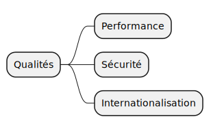

== 10. Critères de qualité

[%notitle.part10]
=== Contenu

Critères de qualité et cas d'utilisation permettant de les évaluer.

[.notes]
--
* les critères de qualité ont une influence sur les décisions architecturales
* sur des petits projets de TMA => je n'ai pas rempli cette partie
* c'est un template, piochez ce que vous voulez
--

[%notitle.part10]
=== Arbre de qualité

[.notes]
--
* c'est parfois vague, générique
* c'est pourquoi il faut les relier à des scénarios concrets
--

[%notitle%auto-animate.part10]
=== Scénario Performance

[.bloc]
--
[.overline]#*Performance*#

Gestion d'au moins 10 000 transactions simultanées lors de la vente de billets tout en répondant aux utilisateurs en moins d'une seconde.
--
