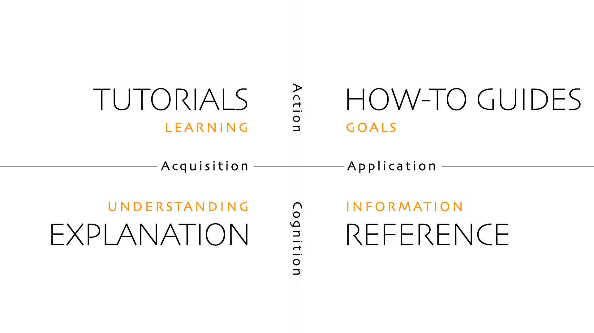

== Récapitulatif

[%notitle%auto-animate.columns]
=== Ecrite ou générée

[.column]
****
. Introduction icon:pencil[] icon:gears[]
. Contraintes icon:pencil[]
. Contexte icon:gears[]
. Solution icon:pencil[]
. Vue boîtes icon:gears[]
. Vue exécution icon:gears[]
****

[.column]
****
[start=7]
. Vue déploiement icon:gears[]
. Concepts icon:pencil[] icon:gears[]
. ADR icon:pencil[]
. Qualité icon:pencil[]
. Dette technique icon:pencil[]
. Glossaire icon:pencil[]
****

[%notitle%auto-animate.columns]
=== Ecrite ou générée

[.column]
****
. [.green]#Introduction# icon:pencil[] icon:gears[role=green]
. Contraintes icon:pencil[]
. [.green]#Contexte icon:gears[role=green]#
. Solution icon:pencil[]
. [.green]#Vue boîtes# icon:gears[role=green]
. [.green]#Vue exécution# icon:gears[role=green]
****

[.column]
****
[start=7]
. [.green]#Vue déploiement# icon:gears[role=green]
. [.green]#Concepts# icon:pencil[] icon:gears[role=green]
. ADR icon:pencil[]
. Qualité icon:pencil[]
. Dette technique icon:pencil[]
. Glossaire icon:pencil[]
****

[.notes]
--
* presque la moitié de générée, sans rentrer dans le code, on sort beaucoup d'infos
** peut être fait de manière incrémentale
** structurizr permet d'avoir qu'une seule source à maintenir
* il ne reste plus qu'à distribuer votre documentation
** publisher Confluence, site statique, word (généré depuis Asciidoc)
--

[%notitle]
=== Doc utilisateur ?

Documentation utilisateur ?

[.notes]
--
* dév un framework ou une librairie ?
* un produit utilisé par des clients ?
--

=== Diátaxis

[%notitle, background-color="white"]
=== Diátaxis

